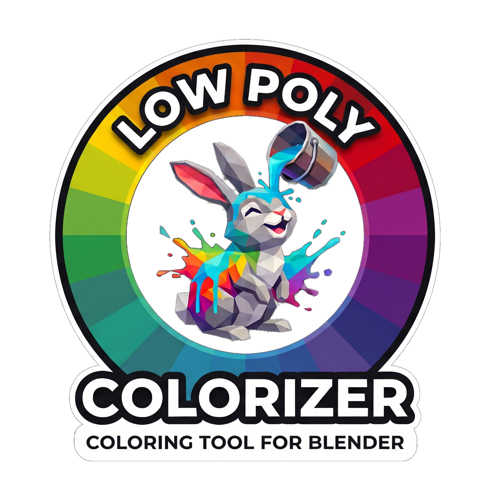

<p align="center">
  
</p>

# Low Poly Colorizer


A high-efficiency Blender extension for painting mesh faces with PBR material properties using an interactive color palette texture – built for clean low-poly asset workflows and 1-click material & shader export to game engines like Godot 4.

Originally developed in-house for **WASDCAT Games'** Blender → Godot production pipeline and shared with the community.

---

## Core Concept

- **Single Palette Texture:** All asset colors are mapped to a compact palette texture. Changing palette settings (tint, shade, saturation) dynamically updates all colorized assets across your project.
- **Single Draw-Call Surface:** All colored faces share a single material and import into the engine as one surface. Each face only stores two references in UV channels – its palette cell and its PBR preset (roughness, metallic, emission, clearcoat) – instead of needing one material per color.
- **Procedural Geometry Nodes:** Full procedural workflow support via the `LPC Set Material` node group – drive palette cells and material presets directly inside modifier trees.
- **Instant Live Assignment:** Click a palette cell in the GPU overlay to paint the selection immediately – no extra Assign step. *Sample* picks up color and preset from already painted faces.
- **Engine-Ready Pipeline:** 1-click template-based export of prepared materials, shaders, and helper classes for Godot 4.x (extensible to other engines).

---

## User Manuals / Benutzerhandbuch

Complete, detailed documentation covering all features, shortcuts, shader integration, and troubleshooting is available as compact PDFs:

- 🇬🇧 **[English User Manual (PDF)](manual/low_poly_colorizer_en.pdf)** · [Online Markdown](docs/manual/en/)
- 🇩🇪 **[Deutsches Benutzerhandbuch (PDF)](manual/low_poly_colorizer_de.pdf)** · [Online Markdown](docs/manual/de/)

---

## Demo Project

A separate repository shows Low Poly Colorizer material usage in action:

- 🎮 **[low-poly-colorizer-demo](https://github.com/wasdcat/low-poly-colorizer-demo)**

---

## Installation

Requirement: **Blender 4.2 LTS or newer** (Extension system).

### Online (Blender Extensions Platform)
1. Open **Edit ▸ Preferences ▸ Get Extensions**.
2. Search for **Low Poly Colorizer** and click **Install**.

### Manual Installation (ZIP)
1. Download `low_poly_colorizer-1.0.1.zip` from [Releases](../../releases) (or build locally using `python scripts/build_dist.py`).
2. In Blender: **Edit ▸ Preferences ▸ Get Extensions ▸ ▾ (top right menu) ▸ Install from Disk…** and select the ZIP file (or drag & drop the ZIP directly onto the Blender window).
3. In the 3D Viewport, press `N` to open the sidebar and switch to the **LPC** tab.

---

## License

The add-on is licensed under **GPL-3.0-or-later**. The shader, material, and script files it exports are **MIT**-licensed, so you can ship them in any project, open or closed. Details: [LICENSE.md](LICENSE.md).

---

## Development

```bash
# Run tests, compile manuals and build extension package into dist/
python scripts/build_dist.py
```