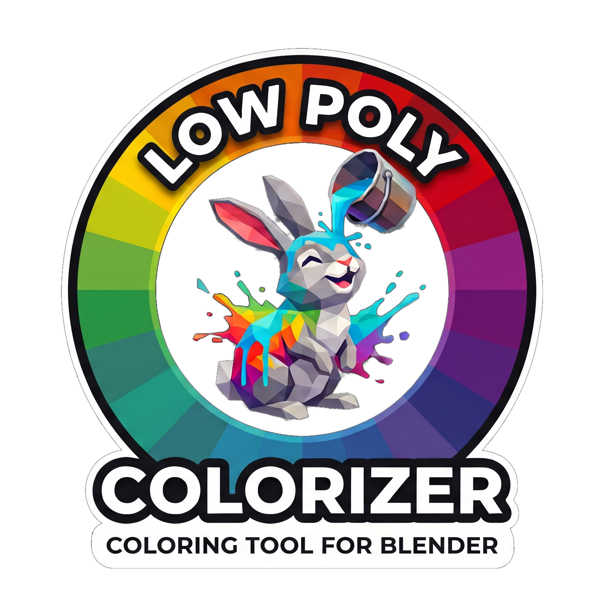

# Vorwort

**Low Poly Colorizer (LPC)** ist eine Blender-Extension zur schnellen, intuitiven und ressourceneffizienten Farb- und Materialgestaltung von 3D-Modellen im Low-Poly-Stil. Sie wurde für die Spieleproduktion bei **WASDCAT Games** entwickelt, um die Lücke zwischen schnellem 3D-Prototyping in Blender und optimalen Draw-Calls in modernen Game-Engines wie **Godot 4** zu schließen.

## Das LPC-Prinzip: Referenzen statt Material-Chaos

Klassische Low-Poly-Workflows scheitern oft an zwei Extremen: Entweder explodiert die Anzahl der Material-Slots durch unzählige Einzelmaterialien, oder Albedo-Textur-Atlanten verbieten flexible physikalische Eigenschaften (PBR).

Low Poly Colorizer löst dies über ein konsistentes **Referenz-Prinzip**:

* **Farb-Referenz (Albedo)**: Jedes Face speichert diskrete Koordinaten (X, Y) einer dynamisch generierten Paletten-Textur (lpc_palette.png).
* **Material-Look (PBR-Preset)**: Jedes Face verweist auf ein benanntes Preset (*Solid*, *Metallic*, *Emission*, *Clearcoat*), das über eine Lookup-Tabelle (lpc_preset_lut.png) aufgelöst wird.
* **Ein einziges Material**: Alle bemalten Flächen teilen sich das Material lpc_multicolor. In der Game-Engine ist der bemalte Teil eines Meshes **eine einzige Surface** – ein Draw-Call statt einem pro Farbe.
* **Live-Propagation**: Ändern Sie später die Farbsättigung der Palette oder die Rauheit eines Presets, aktualisieren sich **sofort alle bemalten Flächen im gesamten Projekt**, ohne dass Meshes neu traversiert werden müssen.

> [!NOTE] Publikationshinweis
> Dieses Benutzerhandbuch wurde mit dem Dokumentations- und Publishing-Tool [markpublish](https://github.com/fwdotcom/markpublish) erstellt.
