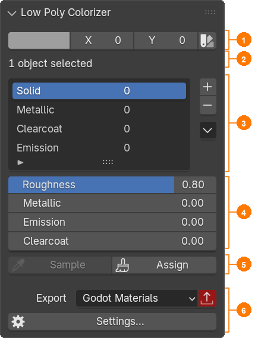

# The User Interface

All controls in Low Poly Colorizer are organized within a compact sidebar panel in the 3D Viewport (**N-Panel ▸ LPC**).

---

## The N-Panel at a Glance

| No. | Section | Description |
|:---:|:---|:---|
| **①** | **Color Selection & Picker** | Displays the color and coordinates $(X, Y)$ of the active palette cell. Clicking the **Palette button** (color picker) opens the interactive modal picker in the viewport. Coordinates can also be edited numerically – this paints the current selection immediately, just like a click in the picker. |
| **②** | **Selection Status** | Dynamically reports the target selection (*“14 faces in 1 object selected”* or *“1 object selected”*). Displays a warning if no preset is selected. |
| **③** | **Preset List & Actions** | Lists all material presets. The number on the right indicates the **refcount** (how many faces currently use this preset). Includes buttons to add (`+`), delete (`-`), and access the actions menu (`▾`). |
| **④** | **PBR Properties** | Controls the physical material properties (*Roughness*, *Metallic*, *Emission*, *Clearcoat*) of the **currently active preset**. Changes propagate instantly to all faces using this preset. |
| **⑤** | **Tools** | **Assign**: Assigns the active brush (color + preset) to the selection – selected faces in Edit Mode, whole objects in Object Mode. **Sample**: *(Edit Mode only)* Loads color and preset of the selected faces into the panel. All selected faces must share the same color and preset. **Select / Deselect**: *(Edit Mode only)* Adds all faces with the current color and preset to the selection, or removes them from it. |
| **⑥** | **Export & Settings** | Target format selection from modular template sets (default: *Godot Materials*), **Export button** with automatic dirty tracking (turns red when the last export is out of date), and button to open **Settings…**. |

---

## Protection & Feedback Mechanisms

* **Refcount Protection**: A preset cannot be deleted while its reference counter is greater than 0, preventing accidental broken mesh references.
* **Visual Dirty Tracking**: Whenever presets, palette settings, or global values change, the Export button highlights in vibrant **red**. After a successful export, it returns to neutral. Painting faces does not affect it: face data reaches the engine with the model (`.blend`/glTF), not with the export.
* **Color & Preset Matching**: *Select* and *Deselect* use strict logical AND matching: only faces that share **both the exact palette cell and the same preset** are affected.

---

## Shortcuts & Workflow Hotkeys

| Key | Context | Function |
|:---|:---|:---|
| `N` | 3D Viewport | Toggle sidebar containing the LPC panel |
| `Tab` | 3D Viewport | Toggle between Object Mode (paint whole object) and Edit Mode |
| `1` / `2` / `3` | Edit Mode | Switch between Vertex, Edge, and Face selection modes |
| `L` | Edit Mode (cursor over face) | Select linked geometry island |
| `A` / `Alt + A` | 3D Viewport | Select all / Deselect all |
