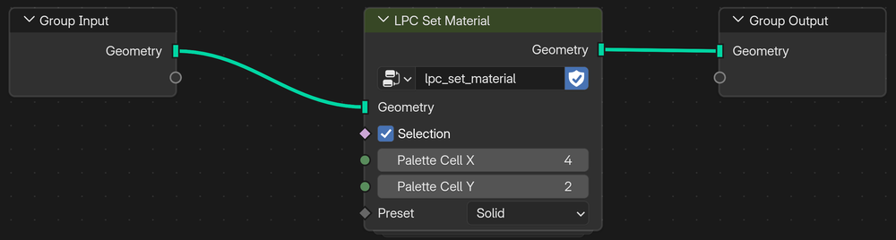

# Engine Export and Integration

Low Poly Colorizer utilizes a generic, template-based export system (`.tpl`) that is flexibly extensible to other engines. The included default target is **Godot 4** (*Godot Materials*).

## One-Click Export to Godot

LPC exports **no mesh geometry** (models are imported as `.blend` or glTF carrying their `lpc_uv0`/`lpc_uv1` maps). The **Export button** opens a folder dialog and writes prepared materials, shaders, and helper classes into the chosen folder:

* **Textures**: `lpc_palette.png` (albedo/colors) and `lpc_preset_lut.png` (PBR lookup table).
* **Shaders & Materials**: Preconfigured ShaderMaterials (`.tres`), shaders (`.gdshader`), and shared code (`.gdshaderinc`) – in two variants, `lpc_multicolor` and `lpc_singlecolor`.
* **Helper Classes**: GDScript class `lpc_singlecolor_resource.gd` for reusable named looks (palette cell, preset, emission) with a generated `Preset` enum.
* **Import Notes**: `README.md` with the texture import settings Godot requires.
* **Dirty Flag Tracking**: The export button illuminates in red whenever the last export is out of date and resets to neutral once synchronized.

## Using the Files in Godot

1. **Texture import settings**: Both PNGs are data textures, not ordinary color textures. Select each one in the *FileSystem* dock, set the following in the *Import* tab, and click *Reimport*: *Detect 3D ▸ Compress To* = **Disabled**, *Compress ▸ Mode* = **Lossless**, *Mipmaps ▸ Generate* = **Off**. For `lpc_preset_lut.png`, additionally set *Process ▸ Fix Alpha Border* = **Off**. The settings survive future re-exports.
2. **Painted meshes**: Assign `lpc_multicolor.tres` as the material override of the imported mesh. It reads color and preset per face from UV/UV2.
3. **Other meshes** (not painted in LPC): Use `lpc_singlecolor.tres`. Palette cell, preset, and emission are set per `MeshInstance3D` as instance shader parameters, so many objects can share this one material and still look different.
4. **Workflow**: Changes to painted faces travel with the model – Godot picks them up when it re-imports the `.blend` or glTF. A new LPC export is only needed when the Export button is red.

## Procedural Workflows with Geometry Nodes

For procedural meshes, generate the `lpc_set_material` node group via the preset menu (**▾**) by selecting **Create Geometry Node Group**:

1. LPC constructs the node group and attaches it as a Geometry Nodes modifier to the active object.
2. In the Node Editor, drive palette coordinates $(X, Y)$ and material preset procedurally through input sockets. The shared `lpc_multicolor` material handles shading automatically.

## Maintenance: Repairing UV Maps (*Fix UV Maps*)

Low Poly Colorizer utilizes two designated UV channels: `lpc_uv0` (palette color coordinates) and `lpc_uv1` (preset LUT coordinates).

When meshes are joined (`Ctrl + J`), cut with Boolean operations, or imported from external sources, UV layers can become swapped or omitted. In this case, LPC automatically displays a highlighted warning box at the bottom of the N-Panel:

> [!WARNING]
> **UV maps need fixing:** Clicking **Fix UV Maps** (Object Mode only) recreates missing LPC UV maps, moves `lpc_uv0` / `lpc_uv1` to the first two UV slots, and ensures seamless import into Godot. If `lpc_uv0` had to be recreated, the palette colors of the affected faces are lost – LPC reports this, and those faces must be repainted.

## Troubleshooting Checklist

| Problem | Cause | Solution |
|:---|:---|:---|
| **No colors in viewport** | 3D Viewport is set to *Wireframe* or *Solid* mode without texture preview enabled. | Press `Z` and switch shading mode to **Material Preview** or **Rendered**. |
| **Faces do not color** | In Edit Mode, no faces are selected, or no preset is selected in the list. | Select faces with `A` or `L` and ensure a preset is highlighted in the list. |
| **Minus button (`-`) disabled** | The selected preset is currently used by mesh faces (refcount > 0). | Repaint those faces with a different preset. *Select* finds faces with the current color **and** preset – pick the matching color first (e.g. via *Sample*). |
| **Exported look differs in Godot** | Textures were not re-exported after modifying presets or palette (red export button). | Click the red **Export button** in the N-Panel to update texture assets. |
| **Colors wrong or presets ignored in Godot** | Godot compressed the data textures on import. | Set the texture import settings (see *Using the Files in Godot*) and click *Reimport*. |
